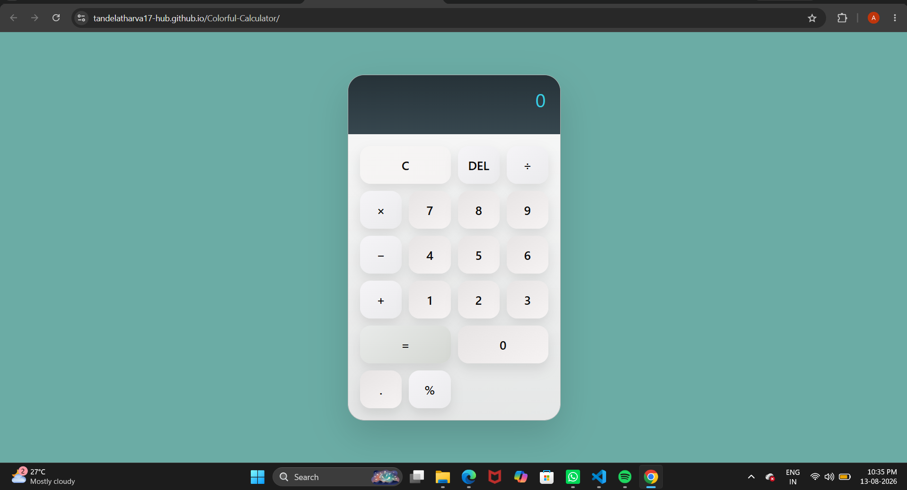

# 🧮 Colorful Calculator

A colorful and responsive calculator built using HTML, CSS and JavaScript.

## 📸 Preview



## 🌐 Live Demo

🔗 [Open Colorful Calculator](https://tandelatharva17-hub.github.io/Colorful-Calculator/)

## 💻 Source Code

🔗 [View Source Code](https://github.com/tandelatharva17-hub/Colorful-Calculator)
## ✨ Features

- Basic arithmetic operations
- Addition, subtraction, multiplication and division
- Clear and easy-to-use interface
- Colorful modern design
- Responsive layout
- Works directly in the browser

## 🛠️ Technologies Used

- HTML5
- CSS3
- JavaScript

## 📂 Project Structure

```text
Colorful-Calculator/
└── index.html
